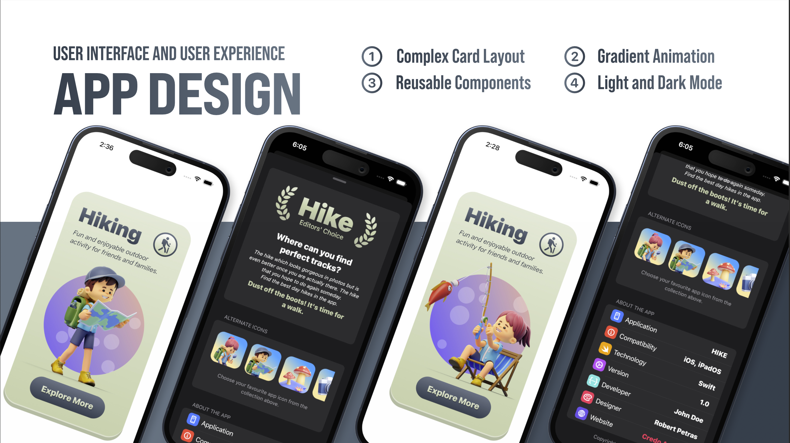
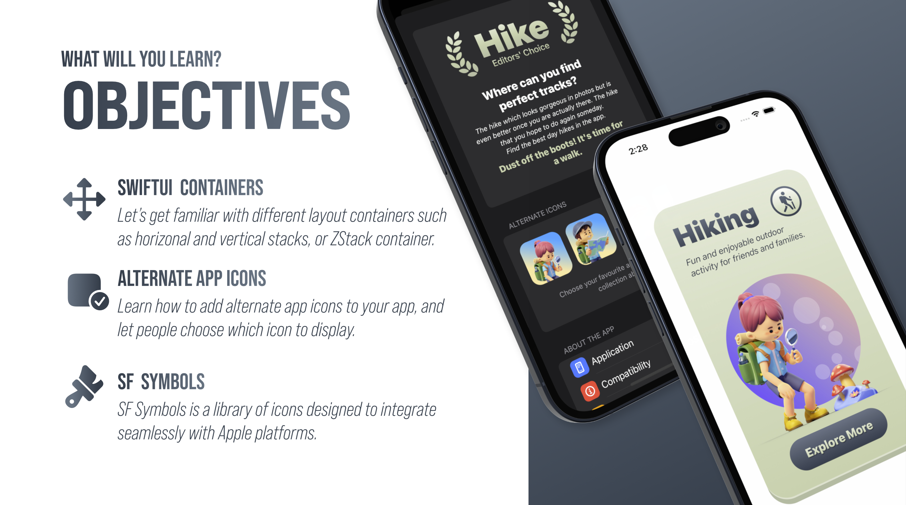

# 🏞️ Hiking App (SwiftUI)



[](https://swift.org)
[](https://developer.apple.com/xcode/)
[](https://developer.apple.com/ios/)
[](https://developer.apple.com/xcode/swiftui/)

---

## 📌 Description
Ce projet est mon premier projet **SwiftUI**, dans lequel j’ai exploré la création d’interfaces modernes et adaptatives pour iOS.  
Il s’agit d’une application fictive autour du thème de la randonnée, avec une **UI soignée** et des composants réutilisables.

---

## 📚 Ce que j’ai appris

À travers ce projet, j’ai pu me familiariser avec plusieurs concepts fondamentaux de **SwiftUI** :

1. **Complex Card Layout** – Construction de vues avec des cartes visuelles avancées.  
2. **Gradient Animation** – Application et animation de dégradés dynamiques.  
3. **Reusable Components** – Création de composants personnalisés réutilisables pour plus de propreté dans le code.  
4. **Light & Dark Mode** – Adaptation automatique de l’interface en fonction du thème système.  
5. **SwiftUI Containers** – Utilisation de `HStack`, `VStack`, `ZStack` pour structurer les vues.  
6. **Alternate App Icons** – Intégration d’icônes alternatives sélectionnables par l’utilisateur.  
7. **SF Symbols** – Utilisation d’icônes natifs Apple pour enrichir l’interface.



---

## 🚀 Installation et Lancement du projet

### 1️⃣ Cloner le projet
```bash
git clone https://github.com/josue-lubaki/Hike.git
cd Hike
```

## License
[MIT License](https://github.com/josue-lubaki/Hike/blob/main/LICENSE)

```
MIT License

Copyright (c) 2025 Josue Lubaki

Permission is hereby granted, free of charge, to any person obtaining a copy
of this software and associated documentation files (the "Software"), to deal
in the Software without restriction, including without limitation the rights
to use, copy, modify, merge, publish, distribute, sublicense, and/or sell
copies of the Software, and to permit persons to whom the Software is
furnished to do so, subject to the following conditions:

The above copyright notice and this permission notice shall be included in all
copies or substantial portions of the Software.

THE SOFTWARE IS PROVIDED "AS IS", WITHOUT WARRANTY OF ANY KIND, EXPRESS OR
IMPLIED, INCLUDING BUT NOT LIMITED TO THE WARRANTIES OF MERCHANTABILITY,
FITNESS FOR A PARTICULAR PURPOSE AND NONINFRINGEMENT. IN NO EVENT SHALL THE
AUTHORS OR COPYRIGHT HOLDERS BE LIABLE FOR ANY CLAIM, DAMAGES OR OTHER
LIABILITY, WHETHER IN AN ACTION OF CONTRACT, TORT OR OTHERWISE, ARISING FROM,
OUT OF OR IN CONNECTION WITH THE SOFTWARE OR THE USE OR OTHER DEALINGS IN THE
SOFTWARE.
```
